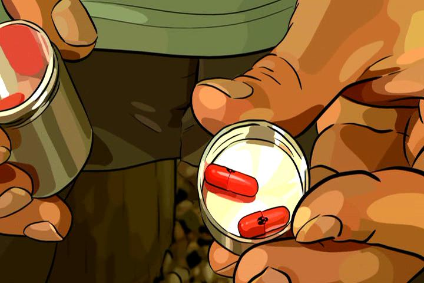
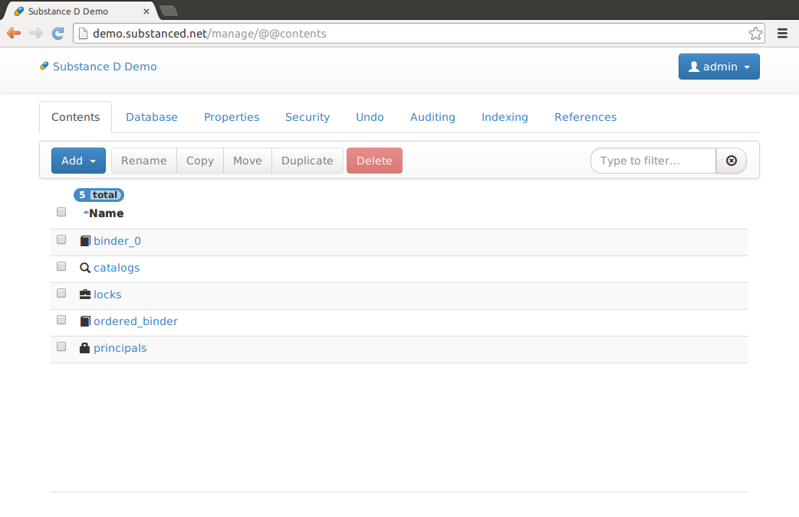

:title: Substance D
:author: Chris McDonough
:description: Introduction to the Substance D Web Application Server
:keywords: substanced, web framework:
:css: hovercraft.css
:data-transition-duration: 1500

.. role:: raw-html(raw)
   :format: html

My Substance D presentation

----

Substance D
===========

A civilized way to build web applications.
------------------------------------------

----

:raw-html:`<i class="icon-4x icon-male" style="color: #30A9C5"> </i>`

by Chris McDonough

----

Worked at Digital Creations (aka Zope Corporation) 2000-2003.

----

Now a principal of Agendaless Consulting in Fredericksburg, VA, US.

----

:raw-html:`<i class="icon-keyboard icon-4x" style="color: #30A9C5"> </i>`

Primary author of ``Pyramid`` web framework, ``Supervisor`` UNIX process 
control system, ``Deform`` form system, ``Colander`` serialization system, 
``Repoze``  collection of middleware, and other unmentionables.  Maintainer 
of ``WebOb`` and other stuff that folks have left behind.

----

PKD's A Scanner Darkly
======================

..
   .. raw:: html

      

         
PKD was my kind of guy!

         <iframe width="560" height="315" src="http://www.youtube.com/embed/oVnvilLFk2Y" frameborder="0" allowfullscreen></iframe>
      

   .. class:: note

      http://www.youtube.com/watch?v=eLeC28enMr0

----

:raw-html:`<i class="icon-meh icon-4x pull-left" style="color: #30A9C5;"> </i>` Substance D is an
"application server" (anybody have a better name?).

----

Developers define "content" (e.g. a blog entry, a product for sale, or a news
item, etc) via plain-old-Python.

----

The "SDI"
=========

----

:raw-html:`<i class="icon-desktop icon-4x pull-left" style="color: #005F6B"> </i>` 

The SDI allows nonexpert but privileged users to create, edit, update, and
delete developer-defined content.

----

The SDI is a view of a hierarchical content space, something like a filesystem.

:raw-html:`<i class="icon-sitemap icon-4x" style="color: #005F6B"> </i>` 

----

:raw-html:`<i class="icon-lock icon-4x pull-left" style="color:#005F6B"> </i>` 
:raw-html:`<i class="icon-user icon-4x pull-left" style="color:#005F6B"> </i>` 

The SDI also allows for managing less contenty aspects of the
system: users, groups, ACLs, and database connections.

----

:raw-html:`<i class="icon-link icon-4x pull-left" style="color: #005F6B"> </i>` 

The SDI is "real-time"; see content and structure changes as they happen 
without page reloads.

----

The SDI is extensible.

:raw-html:`<i class="icon-paperclip icon-4x" style="color: #005F6B"> </i>` 

----

:raw-html:`<i class="icon-smile icon-4x pull-left" style="color: #005F6B"> </i>` 

If you put the SDI in front of your admin users, you'll probably need to write
less code.

----

Unique Features
===============

----

:raw-html:`<i class="icon-undo icon-4x pull-left" style="color: red"> </i>` 

Undo actions taken via the SDI, or any action invoked against the database
programmatically.

----

:raw-html:`<i class="icon-lock icon-4x pull-left" style="color:red"> </i>` 

Manage hierarchical security declarations attached to content objects.

----

Content workflow.

:raw-html:`<i class="icon-comments icon-4x" style="color:red"> </i>` 

----

:raw-html:`<i class="icon-search icon-4x pull-left" style="color:red"> </i>` 

Indexing and searching of content via field, keyword, 
facet, and full-text indexes.

----

:raw-html:`<i class="icon-magnet icon-4x pull-left" style="color:red"> </i>` 

Relate content objects to each other, with optional
referential integrity.

----

:raw-html:`<i class="icon-fast-forward icon-4x pull-left" style="color:red"> </i>` 

Evolve database content over time as your code changes.

----

:raw-html:`<i class="icon-save icon-4x pull-left" style="color:red"> </i>` 

Dump your site's content to the filesystem in a mostly human-readable format.
Reload a dump into the system.

----

:raw-html:`<i class="icon-copy icon-4x pull-left" style="color:red"> </i>` 

An audit log feature exists for high security environments.

----

Built-in monitoring hooks.

:raw-html:`<i class="icon-dashboard icon-4x" style="color:red"> </i>` 

----

Runs under either Python 2 or Python 3.

----

Demonstrations
==============

Because talks are pretty boring.

----

Built With
==========

`ZODB <http://zodb.org>`_

`Pyramid <http://pylonsproject.org>`_

`hypatia <https://github.com/Pylons/hypatia>`_

`colander <http://docs.pylonsproject.org/projects/colander/en/latest/>`_

`deform <http://docs.pylonsproject.org/projects/deform/en/latest/>`_

----

Is It A CMS?
============

----

I don't know, but I don't think so.  I've been doing "CMS" for 12 years and I
don't really know what it means.

----

If your site is dynamic, you can use Substance D to create it.  Particularly
if you can naturally think of your data as treelike.

----

Production Sites
================

----

KUIU
  https://store.kuiu.com

Environmental Health News
  http://www.environmentalhealthnews.org/

The Daily Climate
  http://dailyclimate.org/

----

Plans
=====

A release!  Currently there is none.

Release date mostly depends on how fast we can address issues in the Github
issue tracker.

----

Development
===========

On GitHub in the Pylons Project: https://github.com/Pylons/substanced

News/FAQ/docs via http://substanced.net

----

Questions
=========

:raw-html:`<i class="icon-question-sign icon-4x" style="color:red"> </i>` 

